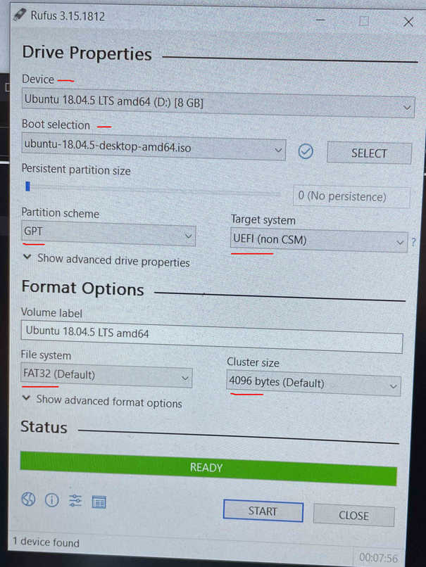

# re_install_ubuntu
If you want to reinstall Ubuntu 18.04.xx when you have Ubuntu 18.04 and Windows 10 installed!

Note: This procesure is ok even if you do not have Windows 10 installed (single boot). I wrote my PC info here at the time of doing the following steps just for my own reference.

## Pc Info
Name: Dell Alienware
CPU:  Intel(R) Core(TM) i7-9750H @2.60 GHz
GPU:  Geforce RTX 2070 with Max-Q Design
RAM:  16.0 GB
OS type: 64-bit
Disk: 1Tb SSD

## Target:
Current: Have both Ubuntu 18.04.4 LTS and Windows 10 installed, but Ubuntu is not working well.
Target:  Re-install Ubuntu 18.04.4 LTS alongside Windows 10

Note:    I want to have encrypted ubuntu install (for security). Don't worry, it's easy!

## Procedure
### Backup all the important things from your current PC if you can (Optional) e.g.:
1. Github Key
2. .bashrc, .bash_ros, .bash_history
3. Task, COMMANDS
4. List of all the additional pkgs in the ~/app, ~/home

### Create a Windows 10 recovery USB drive:
This is sort of a “black box” in that it tries to fix whatever issue is preventing the Windows OS from booting. This is the first thing you should try, as it’s the quickest and least invasive. When windows booting is not working `System Restore` or `System Image Recovery` is not working and a **Windows 10 recovery USB drive** can save your day! Also, because I do not use my Windows OS oftenly, almost all settings are the default settings after installation. So, I don't need a `System Image Recovery`. If you have important applications, settings, ... on your Windows 10 OS, I highly recommend to make both a **[Windows 10 recovery USB drive](https://www.pcworld.com/article/3140449/everything-you-need-to-know-about-windows-10-recovery-drives.html)** and a **[System Image Recovery](https://www.pcworld.com/article/3011736/how-to-create-an-image-backup-in-windows-10-and-restore-it-if-need-be.html)**.

1. First, obtain an 32GB USB drive and insert it into an open USB port on your PC
2. Right-clicking the Windows icon is the easiest way and type `create a recovery drive` into the search bar.
 

3. You may need to enter your admin password to go further. 
4. In the resulting dialog box, check the box labeled `Back up system files to the recovery drive`.
5. Choose the correct USB and continue the steps to the end.

### Make a live boot USB of "Ubuntu Desktop" 
#### -- Using Ubuntu (Only use if you have no dual boot with Windows OS)
If your Ubuntu system is still accessible, you can use the following:

1. Download "Ubuntu 18.04.5 Image" --> 64-bit PC (AMD64) desktop image (https://releases.ubuntu.com/18.04.5/)
2. Create a bootable USB stick on Ubuntu using "Startup Disk Creator":
  - We’re going to use an application called ‘Startup Disk Creator’ to write the ISO image to your USB stick. This is installed by default on Ubuntu.
  - Insert your USB stick (select ‘Do nothing’ if prompted by Ubuntu)
  - On Ubuntu 18.04 and later, use the bottom left icon to open ‘Show Applications’
  - In older versions of Ubuntu, use the top left icon to open the dash
  - Use the search field to look for 'Startup Disk Creator'
  - Select Startup Disk Creator from the results to launch the application
  - 
  - When launched, Startup Disk Creator will look for the ISO files in your Downloads folder, as well as any attached USB storage it can write to. It’s likely that both your Ubuntu ISO and the correct USB device will have been detected and set as ‘Source disc image’ and ‘Disk to use’ in the application window. If not, use the ‘Other’ button to locate your ISO file and select the exact USB device you want to use from the list of devices. Click Make Startup Disk to start the process.
  - 
  - Before making any permanent changes, you will be asked to confirm the USB device you’ve chosen is correct. This is important because any data currently stored on this device will be destroyed. After confirming, the write process will start and a progress bar appears.
  - 
  - Installation complete. That’s it! You now have Ubuntu on a USB stick, bootable and ready to go.
  - 

#### -- Using Windows (Recommended!)
If you cannot access your Ubuntu system, you’ll have to use another system or your Windows OS. 
1. Check your `BIOS Mode` is `UEFI` or `BIOS`: These days, if you buy a computer pre-installed with Windows, it comes with UEFI boot system. First, you need to check if your Windows is using `UEFI` or legacy `BIOS` and it is mandatory for creating bootable USB stick. Press `Win + R` and type `msinfo32` and then hit enter.
2. Look for `BIOS Mode` entry in the system information window.

3. Based on the `Boot Mode`, you would need to use software **Universal USB Installer (BIOS compatible)** or **Rufus (UEFI compatible)** for creating a bootable USB stick.
4. For the first time Ubunut 18.04 installation alongside Windows 10, I used the following information for making the a live boot USB: 
  - Universal USB Installer vs. Rufus: I used "Rufus" application.
  - MBR vs. GPT: I used "GPT" partitioning scheme.
  - BIOS vs. UEFI: I used "UEFI" boot target system.
  
  

The following articles are very useful for the whole process explained in this tutorial:
 - [how to create live USB of Ubuntu in Windows](https://itsfoss.com/create-live-usb-of-ubuntu-in-windows/)
 - [How to Install Ubuntu 18.04 Alongside With Windows 10 or 8 in Dual Boot](https://www.itzgeek.com/how-tos/linux/ubuntu-how-tos/how-to-install-ubuntu-18-04-alongside-with-windows-10-or-8-in-dual-boot.html) (Main)
 - [How to Install Ubuntu Alongside Windows 10-UEFI](https://itsfoss.com/install-ubuntu-1404-dual-boot-mode-windows-8-81-uefi/)
 - [How to Disable UEFI Secure Boot in Windows 10](https://itsfoss.com/disable-secure-boot-windows/)
 - [Disable secure boot y/n?](https://askubuntu.com/questions/785120/disable-secure-boot-y-n)
 - [MBR or GPT partition when making ubuntu bootable live usb](https://askubuntu.com/questions/1015709/mbr-or-gpt-partition-when-making-ubuntu-bootable-live-usb)
 - [Some basics of MBR v/s GPT and BIOS v/s UEFI](https://wiki.manjaro.org/index.php?title=Some_basics_of_MBR_v/s_GPT_and_BIOS_v/s_UEFI)
 - [What’s the Difference Between FAT32, exFAT, and NTFS?](https://www.howtogeek.com/235596/whats-the-difference-between-fat32-exfat-and-ntfs/)

### Re-install Ubuntu 
I disabled the secure boot before installing the ubuntu for the first time. So, I checked it again here for re-installing Ubuntu. I put an article above for disabling the UEFI secure boot in Windows 10.
 - Check Secure Boot status in Windows 10 OS
     1. Go to Start.
     2. In the search bar, type `msinfo32` and press enter
     3. `System Information` opens. Select `System Summary`.
     4. On the right-side of the screen, look at `BIOS Mode` and `Secure Boot State`. If `Bios Mode` shows **UEFI**, and `Secure Boot State` shows **Off**, then **Secure Boot is disabled**.
     
     

Once you have got the live USB of Ubuntu, plugin the USB. Reboot your system. At boot time, press F2/10/F12 key to go into the BIOS settings and make sure that you have set Boot from Removable Devices/USB option at the top. Save and exit BIOS. This will allow you to boot into live USB.

1. I was in ubuntu OS
2. Plugin the USB boot
3. Restart PC
4. Go to BOIS settings by pressing F12 (or F10/F2) key.
5. set Boot from Removable Devices/USB option at the top
